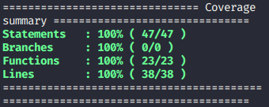
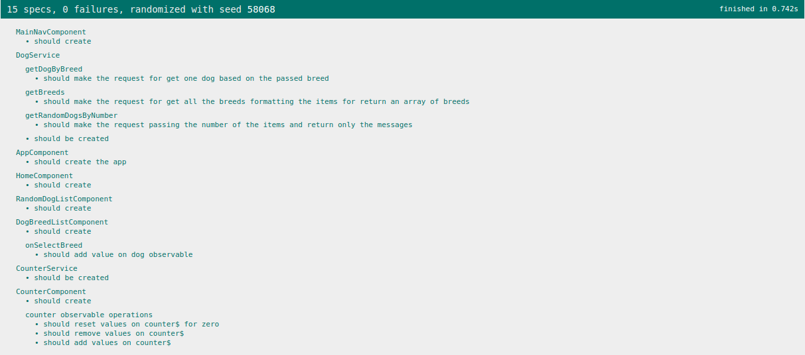
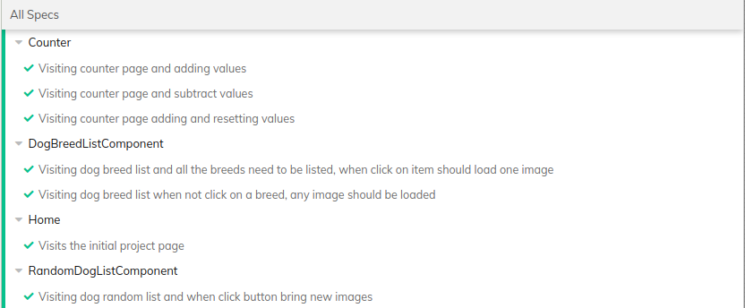

# Ng Cypress Poc

## How run:

```bash
npm install # install all dependencies
```

```bash
npm run build # build application for production
```

```bash
npm run watch # build application with dev options
```

```bash
npm run test # running all unit tests
```

```bash
npm run test:coverage # running all unit tests with coverage report
```

```bash
npm run e2e # open e2e tests environment
```

## Coverage and specs





## Useful links:

- [Dog Ceo API](https://dog.ceo/dog-api/)
