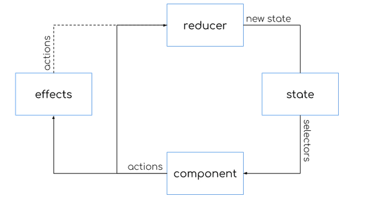

# NgRx

## What is NgRx?

Is a reactive library for Angular that is composed of several modules for managing application state, with Redux inspiration.

## What is Reactive?

By Wikipedia:

- In computing, reactive programming is a declarative programming paradigm concerned with data strams and the propagation of change.

## Modules

NgRx is composed of several modules:

- @ngrx/store
- @ngrx/effects
- @ngrx/router-store
- @ngrx/store-devtools
- @ngrx/entity
- @ngrx/schematics

## What does NgRx solve?

Client applications can be complex. Whether deployed within the context of a browser or a mobile device client applications built with Angular often start simple and grow in complexity in order to deliver the desired functionality with a pratical and valuable user experience.

### The problem

The problem is not inherently the complexity of client applications, but the result of the complexity:

- Is the navigation open or closed?
- Do we show or hide a loading indicator?
- Is a form valid or not?
- What filters were used in a search?
- Is the user logged in?
- Etc.

Keeping track of the state of our application can be difficult

### Singletons

One approach to keeping track of all of this "state" is to store the information in a singleton:

> src/app/search.service.ts

```ts
@Injectable({
  providedIn: "root",
})
export class SearchService {
  filters: Filter[];
  query: string;

  search(): SearchResult {
    // returns the result of the search using the user query and filters
  }
}
```

> src/app/app.component.ts

```ts
@Component({
  template: `
    <app-search
      [filters]="filters"
      [query]="query"
      (search)="onSearch($event)"
    ></app-search>
  `,
})
export class AppComponent {
  constructor(private searchService: SearchService) {}

  onSearch(data: SearchData) {
    // store filters and query
    this.searchService.filters = data.filters;
    this.searchService.query = data.query;

    // perform search
    const result = this.searchService.search();
  }
}
```

In the `AppComponent` we use the `SeachService` to store both the currently selected filters and the user's search query and to perform the search.

### Keeping it in sync

Keeping the various state in our applications becomes difficult to manage via singletons or services:

- Persistance
- Local Storage
- Routing
- Form Data
- UI State
- Pagination

### Immutability

- Massive perframnce gain via `ChangeDetectionStrategy.OnPush`
- Guaranteed accuracy
- Must be enforced

## Why use NgRx?

1. Do not use NgRx until necessary
2. Do use NgRx when state management is difficult

### When **not** to use NgRx

- Simple applications
- Litte to no component intercommunication
- Synchronizing state
- All is well

### When to use NgRx

- Lots of intercommunication
- Slice of data is used in multiple components or services
- Data is mutated in multiple components or services
- Poor performance
- All is not well

## Three principles of redux

> NgRx is inspired by Redux - but it's not Redux.

Redux has 3 core principles:

1. Single source of truth
2. State is read only
3. Changes are made with pure functions

### Single source of truth

- State is stored in the store
- The store is an object tree

### State is read only

- Immutable
- Dispatch actions describing state change

### Changes are made with pure functions

Pure functions must:

1. Return value is only dependent on input values
2. No side effects

## NgRx architecture



- Components dispatch actions describing the state change
- Reducers are pure functions that return the new state
- Selectors access slices of state
- Optional effects perform side effects
