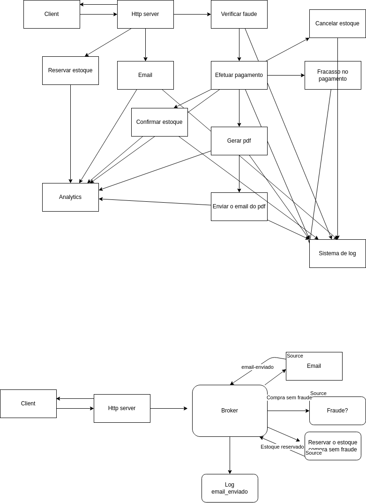

# Apache Kafka Playground

- start zookeeper
  - bin/zookeeper-start-server.sh config/zookeeper.properties
- start kafka
  - bin/kafka-server-start.sh config/server.properties
- create topic
  - bin/kafka-topics.sh --create --bootstrap-server localhost:9092 --replication-factor 1 --partitions 1 --topic ECOMMERCE_NEW_ORDER
- list topics
  - bin/kafka-topics.sh --list --bootstrap-server localhost:9092
- create console producer
  - bin/kafka-console-producer.sh --broker-list localhost:9092 --topic ECOMMERCE_NEW_ORDER
- create console consumer
  - bin/kafka-console-consumer.sh --bootstrap-server localhost:9092 --topic ECOMMERCE_NEW_ORDER --from-beginning
  - --from-beginning is a optional flag, it will tell kafka to look for messages published before the consumer be builded
