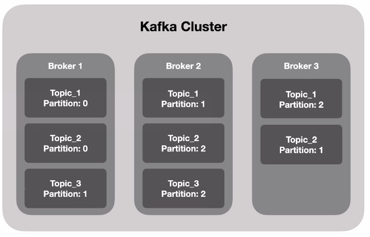
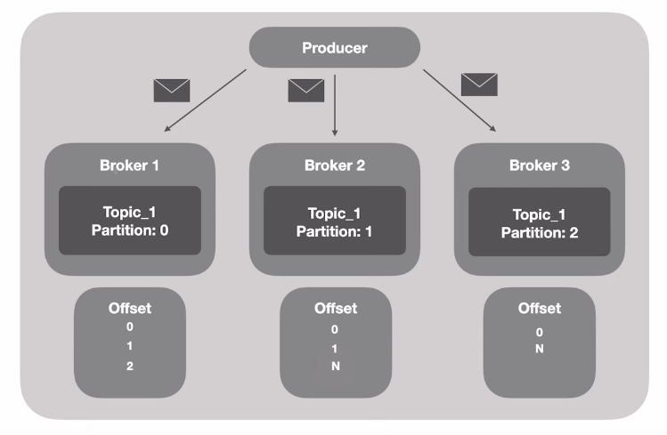
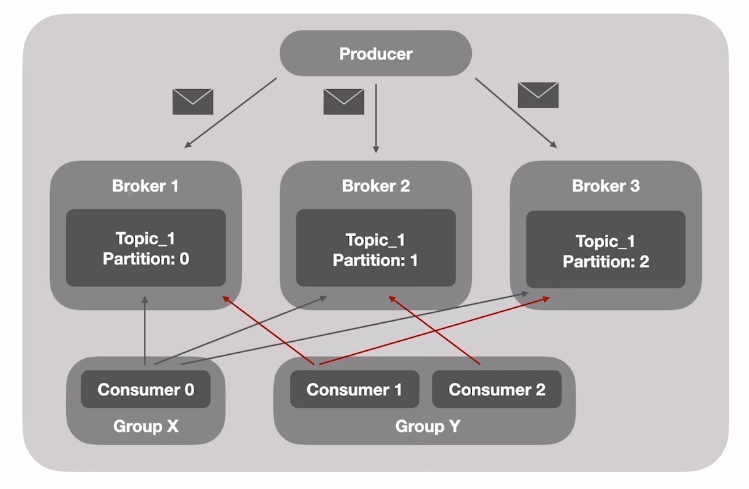

# Code PIX

- Solução para simularmos transgerências de valores entre bancos através de chaves
- Simularemos diversos bancos e contas bancárias que possuem uma chave pix
- Cada cibta bancária poderá cadastrar sua chave pix
- Uma conta bancária poderá realizar uma transferência para outra conta em outro banco, utilizando a chave pix de destino
- Uma transação não pode ser perdida; mesmo que o codepix esteja fora do ar
- Uma transação não pode ser perdida; mesmo que o outro banco esteja fora do ar

## Sobre os bancos

- O banco será um micro serviço com funções limitadas a cadastro de contas e chaves pix, bem como transferência de valores
- Utilizaremos a mesma aplicação para simularmos diversos bancos, mudando cores e código
- Nest.js no backend
- Next.js no frontend

## Sobre o CodePix

- O microserviço CodePix será responsável por intermediar as transferencias bancárias
- Receberá a transação de transferência
- Encaminhará a transação para o banco destino PENDING
- Recebe a confirmação do banco destino CONFIRMED
- Envia confirmação para o banco origem informando quando o banco de destino processou
- Recebe a confirmação do banco de origem de que ele processou COMPLETED
- Marca a transação como completa

## Oque é gRPC

- Framework desenvolvido pela google que tem o objetivo de facilitar o processo de comunicação entre sistemas de uma forma extremamete rápida, leve e independente de linguagem

### Em quais casos podemos utilizar?

- Ideal para microsserviços
- Mobile, Browsers e Backend
- Geração das bibliotecas de forma automática
- Streaming bidireacional utilizando HTTP/2

> RPC - Remote Procedure Call

## Protocol Buffers

- Protocol buffers are Google language-neutral, plataform neutral, extensible mechanism for serializing structured data - XML but smaller, faster and simpler
- [Protocol Buffers](https://protobuf.dev/)
- Arquivos binários < JSON
- Processo de serialização é mais leve que o JSON
- Gasta menos recursos de rede

## HTTP/2

- Nome original criado pela Google era SPDY
- Lançado em 2015
- Dados trafegados são binários e não texto como no HTTP 1.1
- Utiliza a mesma conexão TCP para enviar e receber dados do client e do servidor (Multiplex)
- Server Push
- Headers são comprimidos
- Gasta menos recursos de rede

## gRPC - API "unary"

Client <-> Server

## gRPC - API "Server streaming"

Client <-> Server (Multiple responses)

## gRPC - API "Client streaming"

(Multiple requests) Client <-> Server

## gRPC - API "Bi drectional streaming"

(Multiple requests) Client <-> Server (Multiple responses)

## REST vs gRPC

REST:

- Text/JSON
- Uniderecional
- Alta latência
- Sem contrato
- Sem suport a streaming
- Desing pré-definido
- Bibliotecas de terceiro

gRPC:

- Protocol Buffers
- Bidirecional e Async
- Baixa latencia
- Contrato definido (.proto)
- Suporte a streaming
- Design livre
- Geração de código

## Kafka

- Orientado a eventos
- Plataforma
- Trabalha de forma distribuída
- Banco de dados
- Extremamente rápido
- Não é um sistema tradicional de filas

### Conceito básico

Topic

- Stream que tua como um banco de dados
- Todos os dados ficam armazenados, ou seja, cada Topic tem seu local para armazenar seus dados
- Tópico possui diversas partições
  - Cada partição é definida por um número
  - Você é obrigado a definir a quantidade de partições quando for criar um novo tópico

## Kafka Cluster

- Conjunto de Brokers
- Cada Broker é um server
- Cada Broker é reponsável por armazenar dados de uma partição
- Cada partição de topico está distribuído em diferentesS brokers

### Ecossistema

- Kafka Connect
  - Connectors
- Confluent Schema Registry
- Rest Proxy
- ksqlDB
- KafkaStreams
