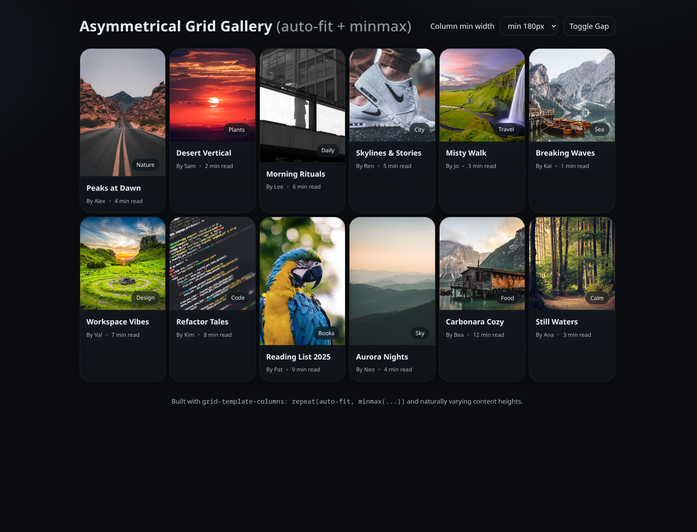

# Assymetrical Grid

## 🔑 Key idea

Instead of forcing uniform card heights, you let content dictate card size, while Grid ensures responsive wrapping with `auto-fit + minmax()`.

## The Base - CSS Grid + auto-fit + minmax()

```css
.grid {
  display: grid;
  grid-template-columns: repeat(auto-fit, minmax(220px, 1fr));
  gap: 16px;
}
```

- `display: grid` -> activates Grid layout.
- `repeat(auto-fit, …)` -> automatically creates as many columns as fit in the container.
- `minmax(220px, 1fr)` -> each column must be at least 220px wide, but can grow to take up remaining space (1fr).

## Asymmetry from Content Height

Unlike Flexbox, Grid rows are by default _equal height per row._
But here, each card’s height is determined by its content (especially the image aspect ratio, used 200px min height to not make card weird).

- Tall images = tall cards.
- Wide/short images = short cards.

Because rows don’t force equal heights, you get a staggered / Pinterest-like look.

## Prints



